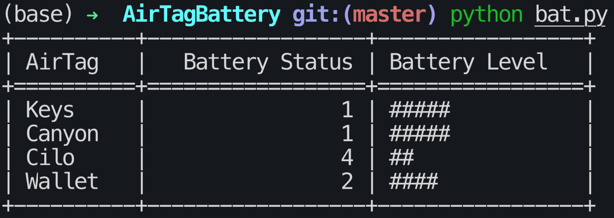

# AirTagBattery

Apple removed the battery status of AirTags from the FindMy app. This script reads the battery status from the FindMy cache for all AirTags and displays battery level.

## Usage

Make sure the terminal has full disk access:
System Settings > Privacy & Security > Full Disk Acess > allow for Terminal (or iTerm)

### Python script

1. Make sure all requirements are installed by running ´pip3 install -r requirements.txt´.

2. Run `python bat.py`

### Executable

A compiled executable is also located under `dist`.
Simply run `./bat`.

